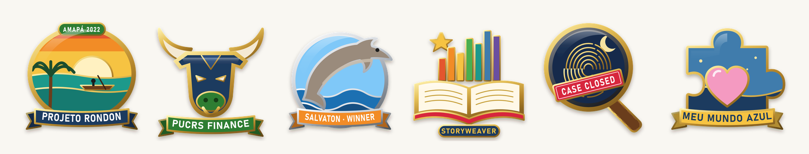
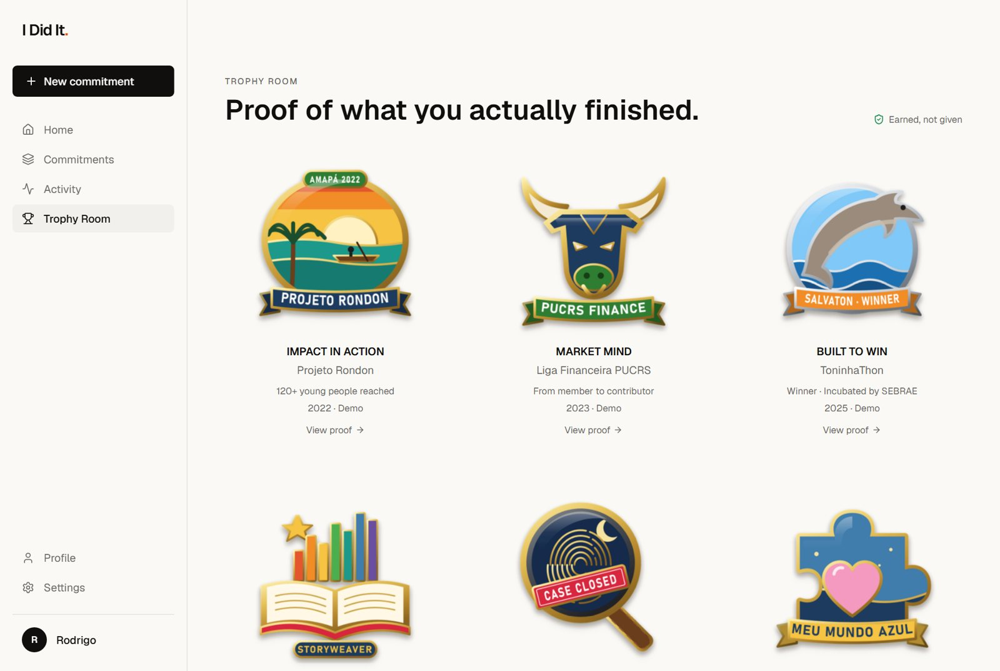
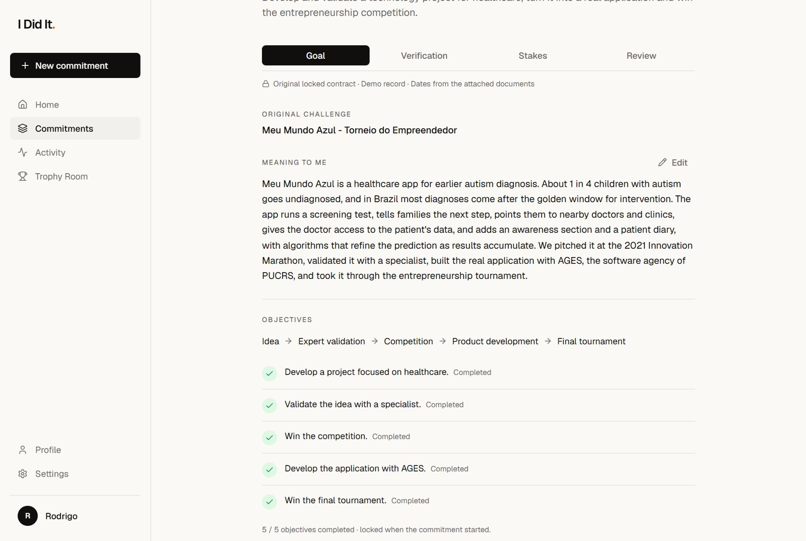
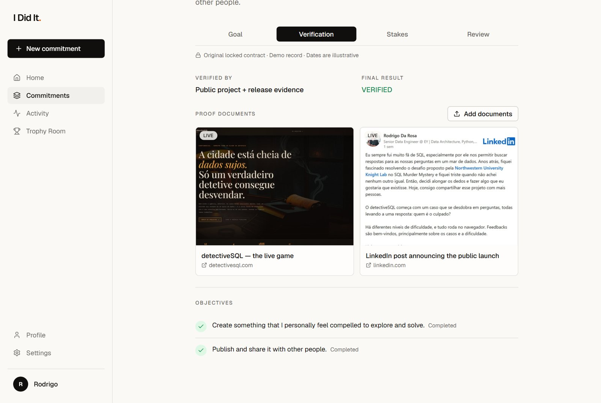
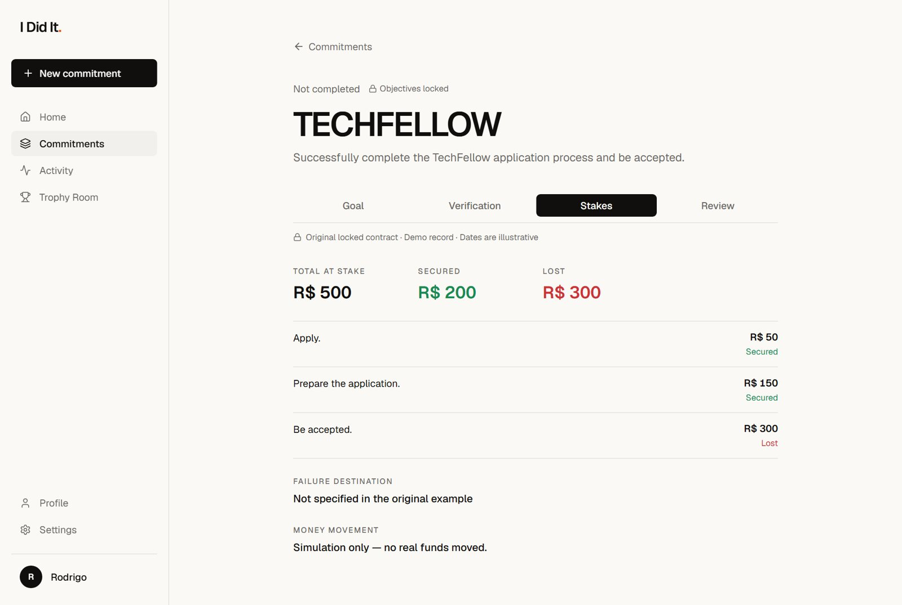

<div align="center">

# I Did It.

**Don't just say it. Prove it.**

A personal record of commitments: objectives locked up front, a stake on each one,<br>
real proof attached, and a trophy only when the work is actually done.



</div>

---

## What it is

Most portfolios list what someone *says* they did. **I Did It** turns each achievement into a small contract you can inspect:

1. **Lock the objectives.** Before starting, you write down what "done" means. Once locked, objectives can't be edited.
2. **Put something at stake.** Each objective carries part of the stake; the commitment's total is their sum.
3. **Attach the proof.** Photos, PDFs, posts, repositories and live websites sit next to the record.
4. **Earn the trophy.** A one-of-a-kind enamel pin is awarded only when every objective is met. Failed attempts stay on the record, without a trophy.

This repository is Rodrigo da Rosa's working profile, with nine real commitments from 2021 to today, including this project itself.

<table>
  <tr>
    <td width="50%"><br><sub><b>Trophy Room</b>: every verified commitment as a collectible pin</sub></td>
    <td width="50%"><br><sub><b>Goal</b>: what the project is, why it matters, and the locked objectives</sub></td>
  </tr>
  <tr>
    <td width="50%"><br><sub><b>Verification</b>: proof documents, including live previews of real pages</sub></td>
    <td width="50%"><br><sub><b>Stakes</b>: each objective's share, secured or lost</sub></td>
  </tr>
</table>

## The records

| Trophy | Project | Period | Objectives | Stake |
|---|---|---|:---:|---:|
| **Impact in Action** | Projeto Rondon: workshops for 120+ young people in Vitória do Jari, Amapá | Nov 2021 – Jul 2022 | 5 / 5 | R$ 500 |
| **Market Mind** | Liga Financeira PUCRS: educational content and the first Financial Markets Week | Mar – Aug 2023 | 4 / 4 | R$ 450 |
| **Built to Win** | ToninhaThon: SalvaTon, 1st place, incubated by SEBRAE | 2025 | 3 / 3 | R$ 500 |
| **Data for Millions** | Pratham Books: Airflow → PostgreSQL analytics platform for StoryWeaver (Develop For Good) | May – Aug 2023 | 3 / 3 | R$ 500 |
| **Case Closed** | detectiveSQL: a browser-based SQL mystery game, live at [detectivesql.com](https://detectivesql.com/) | 2026 | 2 / 2 | R$ 300 |
| **From Problem to Product** | Meu Mundo Azul: an app for earlier autism diagnosis, built with AGES | Aug 2021 – Nov 2022 | 5 / 5 | R$ 500 |
| — | TechFellow: applied and prepared, not accepted | 2026 | 2 / 3 | R$ 500 (R$ 300 lost) |
| — | Behring Founders: in progress | 2026 | 3 / 6 | R$ 500 |
| — | I Did It: this project, in progress ([source](https://github.com/CMaRodrigo/pixel-perfect-capture-7666)) | Oct 2026 – | 3 / 6 | R$ 500 |

Where a record says *"Dates from the attached documents"*, its dates come from the proof itself: work plans, Instagram and LinkedIn posts, Canva and GitLab metadata. Records without that line use illustrative dates.

## What's real and what's simulated

This is a working prototype, and it is explicit about where the edges are:

| | Status |
|---|---|
| Projects, objectives, proof documents | **Real.** Supplied by the owner and bundled with the app. |
| Stakes | **Simulated.** Shown in BRL, but no money is ever held or moved. |
| AI Goal Architect and AI Judge | **Local mocks** behind stable contracts in `src/lib/proof/ai.ts`. |
| Trophy artwork | **Hand-drawn SVG enamel pins**, rendered to PNG. Not AI-generated. |
| Accounts | **None.** The prototype opens straight into Rodrigo's profile. |
| Uploaded files | Stored **only in the visitor's browser** (IndexedDB). Bundled proof is visible to everyone. |

## Tech stack

- **[TanStack Start](https://tanstack.com/start)** with file-based routing, on **React 19** and **Vite**
- **Tailwind CSS v4**, with Radix primitives and lucide icons
- **TypeScript** in strict mode, including `exactOptionalPropertyTypes`
- **Vitest** with Testing Library
- Built for **Cloudflare** through Nitro, and kept in sync with **[Lovable](https://lovable.dev/projects/ce678b21-7673-4402-a639-fc041cc58292)**

## Getting started

The project uses [Bun](https://bun.sh). npm works too: swap `bun` for `npm`.

```sh
git clone https://github.com/CMaRodrigo/pixel-perfect-capture-7666.git
cd pixel-perfect-capture-7666
bun install
bun run dev
```

Then open the URL printed in the terminal.

| Command | What it does |
|---|---|
| `bun run dev` | Start the dev server with hot reload |
| `bun run build` | Production build (also regenerates `src/routeTree.gen.ts`) |
| `bun run preview` | Serve the production build locally |
| `bun run test` | Run the test suite once |
| `bun run lint` | Lint with ESLint and Prettier |
| `bun run format` | Format everything with Prettier |

## Project structure

```
src/
├── routes/                    File-based routes (TanStack Start)
│   ├── app.tsx                App shell: sidebar and mobile tab bar
│   ├── app.index.tsx          Home
│   ├── app.commitments.*      Commitment list, record, proof and result pages
│   ├── app.trophies.*         Trophy Room and a single trophy's record
│   ├── app.activity.tsx       Timeline of everything that happened
│   ├── app.profile.tsx        Public-facing profile
│   └── app.new.tsx            New commitment wizard
├── components/proof/
│   ├── ContractRecord.tsx     The Goal / Verification / Stakes / Review tabs
│   ├── TrophyRoom.tsx         Trophy grid shared by the profile and Trophy Room
│   └── Badge.tsx              Trophy artwork
├── lib/proof/
│   ├── demo-data.ts           The nine records: objectives, stakes, dates, proof
│   ├── demo-trophies.ts       Trophy names, subtitles and artwork
│   ├── store.tsx              App state, persisted in the browser
│   ├── ai.ts                  Goal Architect and AI Judge contracts
│   ├── payments.ts            StakeProvider contract (simulated)
│   ├── badges.ts              Trophy generator contract
│   └── documents.ts           Browser storage for uploaded proof files
└── assets/                    Enamel pins and proof files (images, PDFs, previews)
```

## Architecture

A few boundaries keep the prototype honest and make each piece easy to swap for a real service later:

- **State** lives behind `useProof()` in `store.tsx`. Pages never touch storage directly, so the internals can move to a backend without changing them.
- **AI roles** sit behind the contracts in `ai.ts`. The Judge only evaluates evidence against locked objectives and never rewrites them.
- **Money** only moves through the `StakeProvider` interface in `payments.ts`. Today that is a simulation, and the UI says so.
- **Trophies** come only from `badgeGenerator`: one per passed commitment, never for a failed one.
- **Supplied records refresh themselves.** When a record changes in `demo-data.ts`, browsers that saved an older copy pick up the new title, dates, objectives, stakes, meaning and documents, while keeping the owner's own edits and uploads.

`AGENTS.md` holds the full list of conventions for anyone, human or AI, working in the codebase.

## Adding proof to a record

Records are defined in `src/lib/proof/demo-data.ts`. A record's options look like this:

```ts
challenge("detectivesql", "detectiveSQL", "Create a SQL project…",
  ["Create something…", "Publish and share it…"],   // objectives
  [/* evidence labels */], "Public project + release evidence",
  "2026-09-24",                                      // completion date
  {
    start: "2026-02-14",
    stakes: [200, 100],                              // BRL per objective; the total is the sum
    meaning: "What the project is and why it matters…",
    documents: [
      // A file bundled with the app; PDFs get a first-page `preview` image for their card
      { id: "…", name: "pitch.pdf", mimeType: "application/pdf", src: pitchPdf, preview: pitchCover, addedAt: "…" },
      // An external page: screenshot card that opens the link
      { id: "…", name: "notion", mimeType: "text/html", src: screenshot, href: "https://…", addedAt: "…" },
      // A frameable page: live preview, with the screenshot shown while it loads
      { id: "…", name: "site", mimeType: "text/html", src: screenshot, href: "https://…",
        embed: "https://…", embedWidth: 1280, addedAt: "…" },
    ],
  });
```

Put files in `src/assets/` and import them at the top of the file. Keep each file well under Cloudflare's 25 MiB per-asset limit; large PDFs exported from Canva can be re-rendered to a few MB without visible loss. Use `embed` only for pages that allow framing. Notion, GitLab and the regular Canva view block it, so give them a screenshot with `href` instead. LinkedIn posts (`/embed/feed/update/…`) and Canva's `?embed` links can be framed.

## Working with Lovable

This repository syncs both ways with the Lovable editor. Commits pushed to `main` appear in Lovable, and changes made in Lovable land here.

> [!IMPORTANT]
> Never force-push or rewrite history that is already on `main`, or the project history on Lovable's side will be lost. Keep `main` in a working state.

To update the live site after pushing, open the project in Lovable and click **Publish → Update**.

---

<div align="center"><sub>Built by Rodrigo da Rosa · The badge is the symbol. The proof is behind it.</sub></div>
